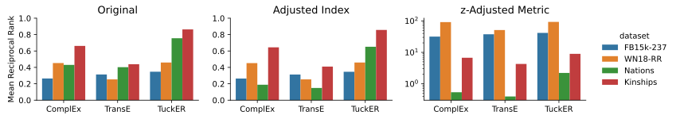

# Ranking Metrics Manuscript Supplement

[](https://arxiv.org/abs/2203.07544)
[](https://doi.org/10.5281/zenodo.6347429)

This repository contains analysis and supplementary information
for [A Unified Framework for Rank-based Evaluation Metrics for Link Prediction](https://arxiv.org/abs/2203.07544),
non-archivally submitted to [GLB 2022](https://graph-learning-benchmarks.github.io/glb2022).

📣 **Main Results** 📣 There's a dataset size-correlation for common rank-based
evaluation metrics like mean rank (MR), mean reciprocal rank (MRR), and hits at
k (H@K) that makes them difficult to compare across datasets. We used the
expectation, maximum, and variance of each metric to define adjusted metrics that don't
have a dataset size-correlation and are more easily comparable across datasets.



🖼️ **Figure Summary** 🖼️ While the MRR on, e.g., Nations and WN18-RR appears
similar for ComplEx, the _adjusted index_ reveals that when adjusting for
chance, the performance on (the larger) WN18-RR is more remarkable. The
_z-adjusted_ metric allows an easier direct comparison against the baseline that
suggests the results on smaller datasets are less considerable, despite
achieving better unnormalized performance.

## ♻️ Reproduction

After installing `tox` with `pip install tox`, do the following:

1. `tox -e collate` to build the combine results files
2. `tox -e plot` to summarize the results files as plots

## 👋 Attribution

### 📖 Citation

```bibtex
@article{hoyt2022metrics,
    archivePrefix = {arXiv},
    arxivId = {2203.07544},
    author = {Hoyt, Charles Tapley and Berrendorf, Max and Gaklin, Mikhail and Tresp, Volker and Gyori, Benjamin M.},
    eprint = {2203.07544},
    month = {mar},
    title = {{A Unified Framework for Rank-based Evaluation Metrics for Link Prediction in Knowledge Graphs}},
    url = {http://arxiv.org/abs/2203.07544},
    year = {2022}
}
```

### ⚖️ License

The code in this package is licensed under the MIT License. The model, data, and
results are licensed under the CC Zero license.

### 🎁 Support

This project has been supported by several organizations (in alphabetical
order):

- [Harvard Program in Therapeutic Science - Laboratory of Systems Pharmacology](https://hits.harvard.edu/the-program/laboratory-of-systems-pharmacology/)
- [Ludwig-Maximilians-Universität München](https://www.en.uni-muenchen.de/index.html)
- [Mila](https://mila.quebec/)
- [Munich Center for Machine Learning (MCML)](https://mcml.ai/)

### 🏦 Funding

This project has been funded by the following grants:

| Funding Body                                             | Program                                                                          | Grant         |
|----------------------------------------------------------|----------------------------------------------------------------------------------|---------------|
| DARPA                                                    | [Young Faculty Award (PI: Benjamin Gyori)](https://indralab.github.io/#projects) | W911NF2010255 |
| German Federal Ministry of Education and Research (BMBF) | [Munich Center for Machine Learning (MCML)](https://mcml.ai)                     | 01IS18036A    |
| Samsung                                                  | Samsung AI Grant                                                                 | -             |
