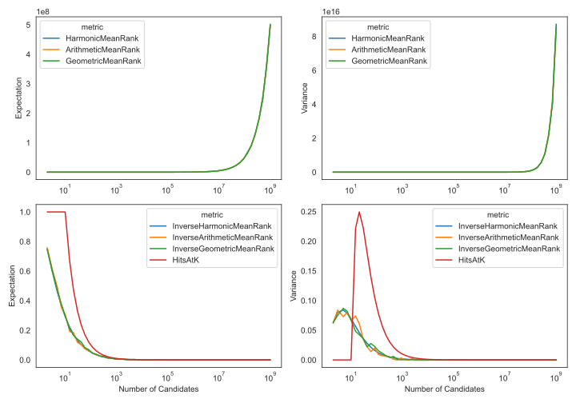

## Characterization of Metrics

This plot shows the expectation and variance for datasets with `n` entities in
the standard case where for a dataset with `n`
entities, there are `n` ranking tasks for which the number of candidates is
also `n`. The upper plots show the standard variants of the metrics (i.e., MR,
GMR, HMR) and the lower plots show the respective reciprocal variants of the
metrics (i.e., IMR, IGMR, MRR) as well as the Hits at K for all K up to half the
order of magnitude of the number of entities. Closed form solutions were used
when possible, otherwise 500 samples were used in a Monte-carlo simulation.
